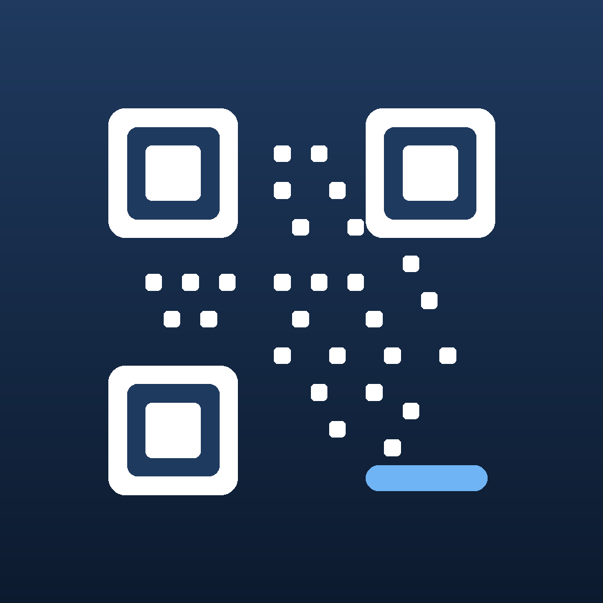
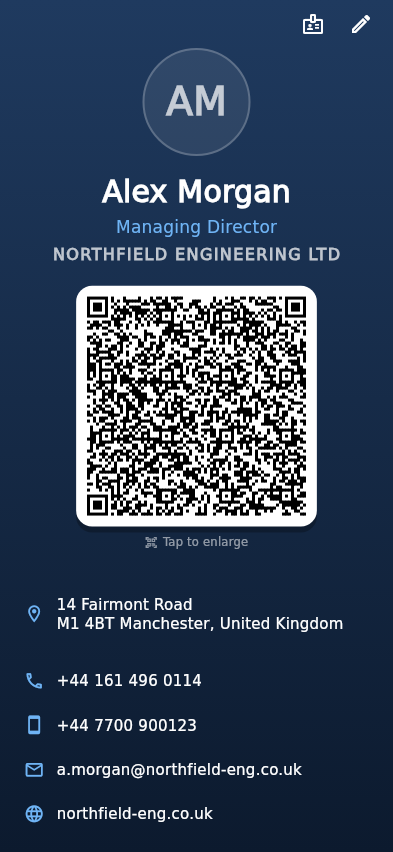
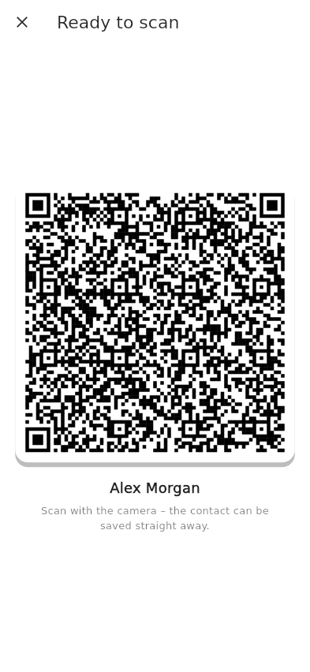
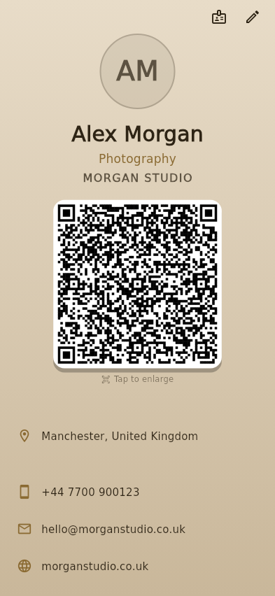
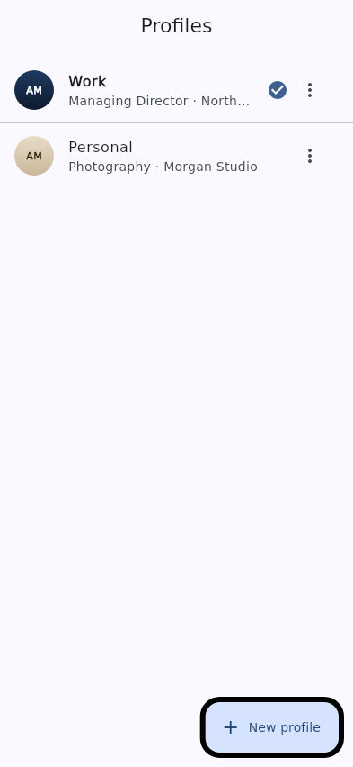
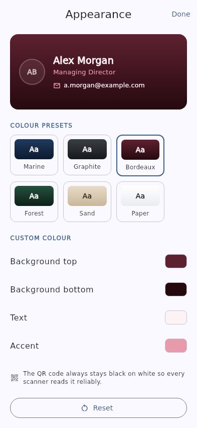

<div align="center">



# Visitenkarte

**Deine Visitenkarte auf einer einzigen Seite – mit Foto, Kontaktdaten und einem
QR-Code, den jeder Standard-Scanner als Kontakt erkennt.**

Alles bleibt auf dem Gerät. Kein Server, kein Account, keine Netzwerkberechtigung.

</div>

---

| Visitenkarte | Vollbild zum Scannen | Eigene Farben |
|:---:|:---:|:---:|
|  |  |  |
| **Profile wechseln** | **Farbeditor** | **Querformat** |
|  |  |  |

## Was die App kann

- **Alles auf einer Seite** – kein Scrollen. Das Layout rechnet die Größen aus
  dem verfügbaren Platz aus und passt vom kleinen 320-px-Gerät bis zum Tablet,
  im Hoch- und im Querformat.
- **QR-Code als vCard 3.0** – die Standard-Kamera von Android und iOS erkennt
  ihn und bietet direkt „Kontakt speichern“ an. Es wird kein Link und kein
  Dienst dazwischengeschaltet, die Kontaktdaten stehen komplett im Code.
- **Mehrere Profile** – z. B. Firma und Privat. Umschalten per Wischen über die
  Karte, über die Punkte darunter oder in der Profilliste. Profile lassen sich
  duplizieren, umbenennen und löschen.
- **Eigene Farben** – Hintergrundverlauf, Schrift und Akzent frei wählbar, mit
  sechs fertigen Vorlagen und Live-Vorschau. Die App warnt, wenn Schrift und
  Hintergrund zu wenig Kontrast haben.
- **Sprache folgt dem Telefon** – Deutsch und Englisch. Bei jeder anderen
  Systemsprache erscheint Englisch.
- **Eigenes Foto** – aus der Galerie oder direkt mit der Kamera aufgenommen.
- **Antippen zum Vergrößern** – der QR-Code lässt sich formatfüllend anzeigen,
  damit das Gegenüber ihn auch über den Tisch hinweg scannen kann.
- **Tippen und Halten** – ein Tipp auf Telefon/E-Mail/Web startet Anruf, Mail
  oder Browser, langes Drücken kopiert den Wert in die Zwischenablage.
- **Homescreen-Widget (Android)** – der QR-Code direkt auf dem Startbildschirm.
- **Übertragung per Antippen (Android)** – das Telefon gibt sich als NFC-Tag
  aus, ein anderes Gerät liest die Karte ohne Scannen.

Details und die Plattformgrenzen bei iOS stehen in
[`docs/widget-und-nfc.md`](docs/widget-und-nfc.md).

Der QR-Code bleibt bewusst immer schwarz auf weiß – auch bei einer dunklen
Karte und im Dunkelmodus –, weil Scanner darauf ausgelegt sind. Das Foto wird
**nicht** in die vCard eingebettet: Ein Bild würde den Code so groß machen,
dass er kaum noch zu scannen wäre.

## Felder

Person (Vorname, Nachname, Position/Titel), Firma (Name, Straße, PLZ, Ort,
Land) und Kontakt (Telefon, Mobil, E-Mail, Website). Leere Felder werden weder
angezeigt noch in den QR-Code geschrieben.

## Selbst bauen

Voraussetzung ist das [Flutter SDK](https://docs.flutter.dev/get-started/install).
`flutter doctor` sagt dir, was noch fehlt.

```bash
git clone https://github.com/DrJakeberg/qrcard.git
cd qrcard
flutter pub get
flutter run          # Telefon per USB dran, oder Emulator
```

Beim ersten Start öffnet sich direkt die Eingabemaske. Danach kommst du über
das Stift-Symbol oben rechts wieder hinein, über das Ausweis-Symbol daneben in
die Profilliste.

**Android** (braucht Android Studio bzw. das Android SDK):

```bash
flutter build apk --release
# -> build/app/outputs/flutter-apk/app-release.apk
```

**iOS** (braucht einen Mac mit Xcode):

```bash
flutter build ios --release
open ios/Runner.xcworkspace   # Signierung setzen, dann auf das Gerät laden
```

## Bauen lassen statt selbst bauen

In `.github/workflows/ci.yml` liegt ein GitHub-Actions-Workflow, der bei jedem
Push und Pull Request läuft:

| Job | Läuft auf | Was er tut |
|---|---|---|
| Analyse und Tests | Ubuntu | `dart format`-Prüfung, `flutter analyze`, `flutter test` |
| Android-APK bauen | Ubuntu | baut die Release-APK und hängt sie als Artefakt an |
| iOS-Build prüfen | macOS | `flutter build ios --no-codesign` |

Die fertige APK holst du unter **Actions → der jeweilige Lauf → Artifacts →
`visitenkarte-android-apk`**. Damit brauchst du für Android keine lokale
Entwicklungsumgebung. Für öffentliche Repositories sind die Runner kostenlos.

Eine direkt installierbare `.ipa` kann der Runner nicht erzeugen – dafür
müssten Apple-Zertifikat und Provisioning-Profil hinterlegt sein.

## In die Stores veröffentlichen

`codemagic.yaml` im Wurzelverzeichnis enthält drei fertige Workflows: eine APK
zum Selbstinstallieren, ein App Bundle für den **Google Play Store** und einen
TestFlight-Build für den **Apple App Store**. Beide Store-Workflows lösen bei
einem Git-Tag `v*` aus und zählen die Build-Nummer selbst hoch.

Was drumherum einzurichten ist – Signaturschlüssel, Play-Dienstkonto,
Apple-API-Key –, steht Schritt für Schritt in
[`docs/veroeffentlichen.md`](docs/veroeffentlichen.md).

Die Store-Materialien in [`docs/store/`](docs/store/) sind auf **Englisch**:
Texte innerhalb der Zeichengrenzen, Icon 512×512, Feature-Grafik 1024×500 und
fünf Screenshots im Format 1080×1920 mit Bildunterschriften. Eine deutsche
Übersetzung der Texte liegt für eine zweite Store-Sprache bereit.

Datenschutzerklärung und Support-Seite liegen als
[`docs/privacy.html`](docs/privacy.html) und
[`docs/index.html`](docs/index.html) bereit und werden über GitHub Pages
ausgeliefert (Settings → Pages → Branch `main`, Ordner `/docs`). Beide Seiten
laden bewusst keine externen Schriften, Skripte oder Zählpixel.

Grundlagen zu Codemagic selbst: [`docs/codemagic.md`](docs/codemagic.md).

## Aufbau

```
lib/
  main.dart                     App-Start, lädt und speichert die Profile
  theme.dart                    Material-3-Theme der Bedienoberfläche
  l10n/                         Übersetzungen (app_de.arb, app_en.arb)
    locale_fallback.dart        Sprachwahl inkl. Rückfall auf Englisch
  models/
    contact_card.dart           Die Kontaktdaten einer Karte
    card_style.dart             Farben einer Karte inkl. Kontrastprüfung
    card_profile.dart           Profil (Karte + Farben) und Profilsammlung
  services/
    vcard.dart                  Erzeugt den vCard-Text für den QR-Code
    card_storage.dart           Lokales Speichern (Texte, Farben, Fotos)
    widget_bridge.dart          Versorgt Widget und NFC mit QR-Bild und vCard
  screens/
    card_screen.dart            Die Visitenkarte (eine Seite, kein Scrollen)
    edit_screen.dart            Eingabemaske
    profiles_screen.dart        Profilliste
    style_editor.dart           Farbauswahl mit Vorschau
    qr_fullscreen.dart          QR-Code formatfüllend
  widgets/qr_panel.dart         QR-Code auf weißem Grund
android/app/src/main/kotlin/…   Widget-Anbieter und NFC-Dienst (Kotlin)
assets/icon/                    Quellgrafik für das App-Icon
tool/                           Erzeugt die Screenshots in docs/
```

### Übersetzungen ändern

Texte stehen in `lib/l10n/app_de.arb` und `lib/l10n/app_en.arb`. Nach einer
Änderung:

```bash
flutter gen-l10n
```

Die erzeugten Klassen liegen daneben und sind eingecheckt, damit `flutter
analyze` ohne Zusatzschritt funktioniert.

### App-Icon ändern

`assets/icon/icon.png` (1024×1024) bzw. `icon_foreground.png` ersetzen, dann:

```bash
dart run flutter_launcher_icons
```

## Tests

```bash
flutter test
```

Abgedeckt sind die vCard-Erzeugung (Feldreihenfolge, Maskierung von
Sonderzeichen, weggelassene Leerfelder), Profile (Anlegen, Wechseln, Löschen,
Speichern/Laden), die Farben samt Kontrastprüfung, die Sprachauswahl sowie das
Layout: Die Karte wird auf sieben Gerätegrößen gerendert und muss ohne Überlauf
und ohne Scrollbereich auskommen – auch bei doppelter System-Schriftgröße.

Die Screenshots zeigen die App auf Englisch – sie landen auch in den Stores.
Der Bild-Generator für `docs/` liegt bewusst außerhalb von `test/`, damit
`flutter test` ihn nicht mitläuft: Die Bilder hängen von den lokal
installierten Schriften ab und würden auf einem anderen Rechner abweichen.

```bash
flutter test tool/generate_previews_test.dart --update-goldens
```

## Datenschutz

Die App fordert keine Netzwerkberechtigung an und sendet nichts. Kontaktdaten
und Farben liegen in den SharedPreferences, die Fotos im privaten
App-Verzeichnis. Beim Deinstallieren wird beides mit entfernt.
